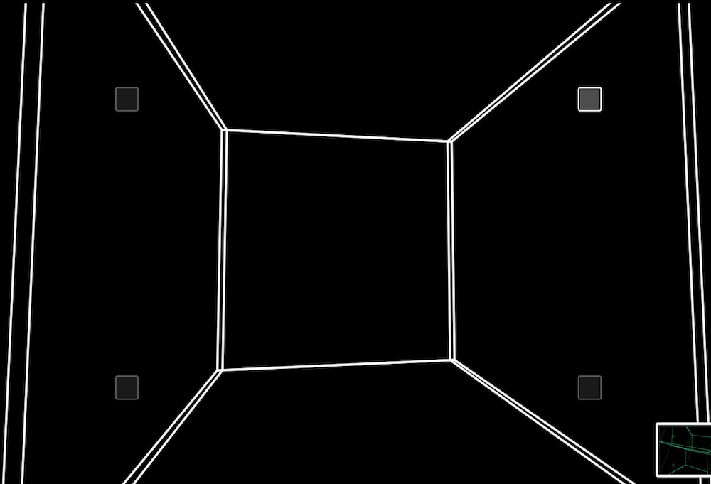

# consciousness
## "thinking outside of the box" literally & figuratively
Imagine your home is a cube. How would you depict psychedelics / altered states of consciousness?

Picture yourself. You live inside a 3D cube. The cube is perfectly square and perfectly comfortable.

You lean on a walls and the roof magically soars up into the sky! The floor slides out like a glass-bottom boat, revealing a stunning reflection of your colorful walls.

This project is a webapp visual metaphor that maps lower states of consciousness (coma, unresponsive wakefulness syndrome, minimally conscious state, and full consciousness) to dimensions (point, line, square, cube). Altered states of consciousness are represented by a fourth spacial dimensions (tesseract a.k.a. hypercube). 

  

## Play with it!
# Releases:

Usually the one at the top is the best:

- [webapp/V26.html](webapp/V26.html)
- [webapp/V25.html](webapp/V25.html)
- [webapp/V24n_modified2.html](webapp/V24n_modified2.html)
- [webapp/V24n_modified.html](webapp/V24n_modified.html)
- [webapp/V23.html](webapp/V23.html)
- [webapp/V19.html](webapp/V19.html)
- [webapp/V04.html](webapp/V04.html)
- [webapp/V02.html](webapp/V02.html)
- [webapp/V01.html](webapp/V01.html)
